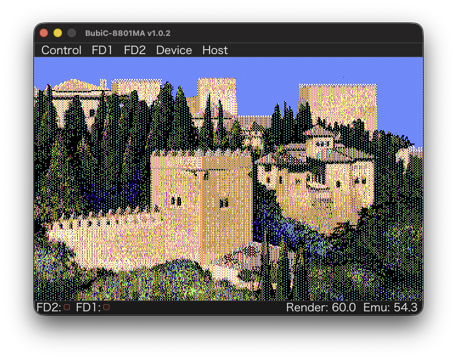

# BubiC-8801MA

<p align="center">
  <a href="https://github.com/bubio/BubiC-8801MA/releases/latest">
    
  </a>
  <a href="https://github.com/bubio/BubiC-8801MA/blob/main/LICENSE">
    
  </a>
  <a href="https://github.com/bubio/BubiC-8801MA/releases/latest">
    
  </a>
</p>


This project is based on the Common Source Project's ePC-8801MA, with Windows-specific parts replaced by SDL3 to support multiple platforms.

Merging the Common Source Project into XM8 was extremely difficult, so this version focuses on core functionality.


<p align="center">
  
</p>


## Supported OS

*   **macOS**: macOS 13 Ventura or later
*   **Linux**: Debian/Ubuntu-based distributions are recommended
*   **Windows**: Windows 11 or later

## License

This project is based on Takeda-san's [ePC-8801MA](https://takeda-toshiya.my.coocan.jp/common/index.html) (Common Source Project), January 1, 2026 edition.

*   **ePC-8801MA**: GPL Version 2
*   **SDL3**: LGPL (GNU Lesser General Public License)
*   **ImGui**: MIT License


## Build

### macOS

```bash
./scripts/build_macos.sh          # Release (default)
./scripts/build_macos.sh Debug    # Debug build
```

### Linux

```bash
# Required packages (Ubuntu / Debian)
sudo apt-get install -y \
  ninja-build pkg-config \
  libasound2-dev libpulse-dev libdbus-1-dev libudev-dev \
  libx11-dev libxcursor-dev libxext-dev libxi-dev \
  libxinerama-dev libxrandr-dev libxss-dev libxtst-dev \
  libwayland-dev libxkbcommon-dev libdecor-0-dev \
  libgbm-dev libdrm-dev

./scripts/build_linux.sh          # Release (default)
./scripts/build_linux.sh Debug    # Debug build
```

### Windows (MSVC)

Visual Studio 2019 or 2022 (with the C++ workload) is required.
From **Developer PowerShell for VS** or a terminal:

```powershell
.\scripts\build_windows.ps1                      # Release x64 (default)
.\scripts\build_windows.ps1 -BuildType Debug     # Debug
.\scripts\build_windows.ps1 -Arch ARM64          # ARM64
```
